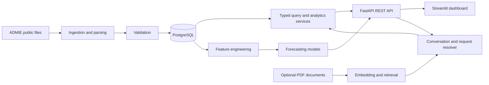

# GridMind GR

A FastAPI and Streamlit application for exploring Greek electricity data through chat, tables and charts. Structured analytics work without Groq, Qdrant or embedding downloads.

## Project overview

GridMind GR is an end-to-end energy analytics platform built around public ADMIE (Independent Power Transmission Operator of Greece) data. It combines a validated data ingestion pipeline, a PostgreSQL analytical store, deterministic query services, machine-learning forecasts and an optional document question-answering workflow.

The project is designed to answer practical questions such as:

- How did system load, renewable production or generation by technology change over a selected period?
- What were the total, average and peak hourly values for a dataset or generation source?
- What is the expected system load for a future day, and how did the forecasting method perform on held-out history?
- Can a user ask these questions through a conversational interface while retaining dataset and date context?

This repository demonstrates data engineering, API design, analytics, applied machine learning and product integration in one cohesive application. It also documents important domain boundaries: the load data excludes Crete, generation already includes RES, reporting periods are treated as nominal hours, and model outputs are estimates rather than official ADMIE forecasts.

## Technology stack

| Area | Technologies | Role in the project |
|---|---|---|
| Language and packaging | Python 3.11+, `setuptools`, virtual environments | Application code, command-line workflows and reproducible installation |
| Data acquisition | `requests`, ADMIE client, `pandas`, `openpyxl`, `xlrd` | Download, parse and normalize spreadsheet-based public energy data |
| Data quality | `pandas`, validation modules, generated test fixtures | Enforce schema, timestamp, coverage and domain checks before persistence |
| Storage | PostgreSQL, SQLAlchemy 2, psycopg | Store hourly load, renewable production, generation and forecast records |
| Backend API | FastAPI, Uvicorn, Pydantic 2 | Typed REST endpoints, request validation, response schemas and OpenAPI docs |
| Analytics | Pandas and parameterized SQL query functions | Aggregate history, filter technologies and calculate totals, means and peaks |
| Forecasting | scikit-learn, Random Forest, gradient boosting, NumPy, joblib | Short-horizon lag-based forecasts and longer-horizon calendar-based projections |
| User interface | Streamlit, requests | Chat, historical data, forecast and health-check views with charts and CSV export |
| Conversational layer | Explicit request parsing, conversation context, Pydantic models | Date-aware follow-ups and deterministic routing to supported analytics operations |
| Optional RAG | Qdrant, Sentence Transformers, PyTorch, PyPDF, LangChain, OpenAI/Groq integrations | Retrieve document excerpts and generate grounded answers when explicitly enabled |
| Testing and operations | Pytest, pytest-asyncio, Docker Compose, environment variables | Automated unit coverage, local PostgreSQL, service startup and configuration |

## Architecture



### Engineering flow

1. **Acquire and normalize:** `AdmieClient` downloads the selected ADMIE categories. Parsers convert source spreadsheets into consistent tabular structures.
2. **Validate before storage:** dataset-specific validators check the normalized frames before rows are written to PostgreSQL. This keeps ingestion failures visible and prevents malformed data from silently entering analytics.
3. **Serve deterministic analytics:** query functions provide controlled access to historical data. The chat path resolves supported user language into a typed dataset, date range and technology filter; it does not execute model-generated SQL.
4. **Forecast with explicit contracts:** short-term load forecasting uses calendar variables and 24-, 48- and 168-hour lags. Longer horizons use a separate calendar-only projection model, with held-out validation metrics returned alongside results.
5. **Present results:** FastAPI exposes JSON responses and interactive OpenAPI documentation. Streamlit consumes the API and renders charts, tables, metadata and CSV downloads.
6. **Extend with optional retrieval:** document RAG is isolated behind configuration flags, so the structured analytics application remains usable without an LLM provider, vector database or embedding download.

## What this project demonstrates

- **End-to-end ownership:** source acquisition, validation, persistence, backend services, modeling and user interface are connected and runnable locally.
- **Data modeling judgment:** load, RES and generation are kept as distinct datasets, with domain-specific interpretation documented rather than hidden in charts.
- **Reliable interfaces:** Pydantic response models, typed request context, explicit endpoint contracts and health checks make behavior observable to API and UI clients.
- **Applied forecasting:** feature engineering, reproducible model training, recursive future prediction, long-horizon modeling and held-out evaluation are implemented as separate concerns.
- **Responsible AI boundaries:** structured questions use deterministic analytics first; optional document answers are instructed to use retrieved excerpts only, and model limitations are surfaced to the user.
- **Testable design:** parsing, validation, analytics, conversation handling and long-term forecasting have focused tests that do not require private data, an LLM key or a live database.

The project is intentionally transparent about what it does not claim. It is an analytical and forecasting application, not a certified settlement system, an official market forecast or an unrestricted general-purpose chatbot.

## Three ADMIE datasets

| Category | Stored table | Interpretation |
|---|---|---|
| `RealTimeSCADASystemLoad` | `system_load` | Net load **without Crete**, plus the separately stored signed Crete cable flow |
| `RealTimeSCADARES` | `res_production` | Aggregate renewable injections |
| `SystemRealizationSCADA` | `generation_actual` | Unit production grouped into lignite, petroleum, natural gas, hydro and RES |

Generation already contains RES. Do not add the separate RES series to generation totals. These are reported SCADA observations, not certified settlement data or household consumption.

**Time limitation:** queries currently use reporting periods 1–24 as nominal hours 00–23. A real 25th load/RES period exists on autumn clock changes and is stored but omitted by this view. Spring files can contain placeholders. Do not use these charts for exact daylight-saving-day totals or clock-time accounting. See [the audit](PROJECT_AUDIT.md).

## Setup

Python 3.11 or newer, Docker and Docker Compose are required for this setup.

```bash
python -m venv .venv
source .venv/bin/activate
python -m pip install -e .
cp .env.example .env
# Edit .env if needed; preserve an existing .env instead of overwriting it.
docker compose up -d postgres
```

The schema is mounted into PostgreSQL on first initialization. For an existing database missing tables, apply the additive schema explicitly:

```bash
docker compose exec -T postgres psql -U gridmind -d gridmind < database/schema.sql
```

Ingest the desired range for each dataset (one day is shown; forecasting needs more than seven days and benefits from substantial history):

```bash
python -m gridmind.data.ingestion system-load --start-date 2026-01-15 --end-date 2026-01-15
python -m gridmind.data.ingestion res --start-date 2026-01-15 --end-date 2026-01-15
python -m gridmind.data.ingestion generation --start-date 2026-01-15 --end-date 2026-01-15
```

Run the API and dashboard in separate terminals with the environment activated:

```bash
uvicorn gridmind.main:app --reload
streamlit run streamlit_app.py
```

API documentation: `http://127.0.0.1:8000/docs`. Dashboard: `http://localhost:8501`. Set `API_BASE_URL` when the backend is hosted elsewhere.

## Chat and API

Examples:

- `Show load from 2026-01-01 to 2026-01-31`
- `RES 2026-01-15`
- `Show generation by source 2026-01-15`
- `Natural gas production 2026-01-15`
- `Κατανάλωση 15 Ιανουαρίου 2026`
- `Forecast load tomorrow`
- `Forecast load 2027-09-12`
- `Forecast load in one year`

Supported date expressions include ISO dates/ranges, a single Greek written date, European numeric dates, today, yesterday, tomorrow, last month and “in one year”. The chat remembers the latest resolved dataset, date range and technology filter in the current browser session. It supports the follow-up patterns below, but not unrestricted natural language. Responses include deterministic totals, peaks, source identifiers and chart rows. Date-free questions receive usage guidance unless optional document RAG is enabled.

| Endpoint | Purpose |
|---|---|
| `POST /api/v1/chat` with `{"message": "load 2026-01-15"}` | Chat analytics |
| `GET /api/v1/data/load?date=2026-01-15` | Load history |
| `GET /api/v1/data/res?start_date=2026-01-01&end_date=2026-01-31` | RES history |
| `GET /api/v1/data/generation?date=2026-01-15&technology=hydro` | Production by source |
| `GET /api/v1/forecasts/load?date=2026-09-01` | Generate a load forecast |
| `GET /health` | API liveness only |

Forecast requests return one target day and do not modify the database. Chat and the forecast page support dates up to **two calendar years after the latest load observations**:

- Up to 14 days: the existing Random Forest uses observed and recursively predicted lag values.
- Beyond 14 days: a separate calendar-only gradient boosting model directly predicts all 24 target hours. It uses hour, weekday, month and annual seasonal features; it does not generate intermediate days or feed predictions back into itself.

For example, history ending on 2026-08-31 supports `Forecast load 2027-09-12`, with a maximum target of 2028-08-31. `Forecast load in one year` means one calendar year after today's date in Europe/Athens, subject to the same data-relative horizon limit. The forecast remains a single day, not the entire intervening year.

Long-term forecasts require at least two years of history and at least 80% valid hourly coverage in each month of the latest two annual cycles. The last year is held out for evaluation; a fresh model is then fitted on all valid history. Responses include the validation metrics and lower/upper lines based on the 90th percentile of absolute held-out errors. These are descriptive historical error bounds, not guaranteed 90% prediction intervals. They must not be added together to claim a daily or annual confidence interval.

Long-term projections assume historical calendar patterns persist. Future weather, holidays, economic growth and structural demand changes are not modeled. See [year-ahead validation](YEAR_AHEAD_VALIDATION.md) for the measured results and limitations. Estimates are not official ADMIE forecasts.

## Follow-up questions

After `Show load 2026-01-15`, you can ask:

- `and the next day?` — keeps load and moves to January 16.
- `show renewables instead` — keeps the current dates and switches to RES.
- `what about natural gas?` — keeps dates and selects gas generation.
- `what was the peak?` — retrieves the current selection's summary, including the peak and its hour.

After `Forecast load 2027-09-12`, `and 2027-09-13?` keeps the forecast intent. `same day next year` shifts the currently selected dates by one calendar year, within the forecast horizon. Next/previous day, week, month and year shift the selected day or range; “tomorrow” and “in one year” remain relative to today. A complete dated request overrides previous selections. A general generation request clears an earlier technology filter.

Use **New chat** to clear messages and remembered selections. Context is kept in Streamlit session state, not shared globally between API users. Reloading/reconnecting the browser session may clear it. Failed requests keep the previous successful context. Unsupported comparisons receive an explicit message; arbitrary causal explanations and multi-turn reasoning are not yet supported.

API callers send back the `context` object returned by the previous chat response:

```json
{
  "message": "and the next day?",
  "context": {
    "dataset": "load",
    "start_date": "2026-01-15",
    "end_date": "2026-01-15",
    "technology": null
  }
}
```

The context is validated and resolved into a fresh database/model request. A relative follow-up without context asks for a starting date.

## Forecasting commands

The load model artifact is intentionally not tracked. Create it through the reproducible training command:

```bash
python -m gridmind.models.load_forecast --train --days 1
python -m gridmind.models.load_forecast --days 2
python -m gridmind.models.res_forecast --days 1
python -m gridmind.models.load_backtest
python -m gridmind.models.res_backtest
```

Forecast CLIs save future predictions to PostgreSQL; load `--train` also writes the model artifact. Historical load simulations retrain using observations strictly before the requested date. Backtests currently use fixed 2026 month boundaries and observed daily lags; their scores represent rolling day-ahead inputs, not a month-long recursive forecast from a single origin.

## Optional documents and notebooks

Set `ENABLE_RAG=true` and `GROQ_API_KEY` to enable document answers; configure `LLM_MODEL` as appropriate for your provider account. Run `docker compose --profile rag up -d qdrant`. The first embedding call may download a multilingual model. Documents can be indexed programmatically using `PDFIngestionPipeline` and `IngestionConfig` in `gridmind.rag.ingestion`.

There is no document-upload API. The former dashboard upload button called a nonexistent route and has been removed. Optional provider calls and document indexing were not exercised in the audit.

Install notebook dependencies with `python -m pip install -e '.[notebooks]'`. Run existing notebooks from their `notebooks/` directory.

## Verification

```bash
python -m pytest -q
python check_db.py
python check_counts.py
python check_dates.py
```

Tests use generated spreadsheet fixtures and mocked analytics; no private files, LLM key or database is required. Live database/API and public ADMIE sample checks are described in [PROJECT_AUDIT.md](PROJECT_AUDIT.md).
